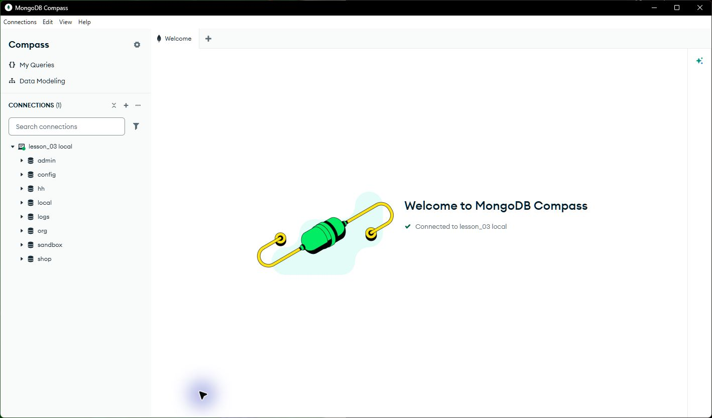
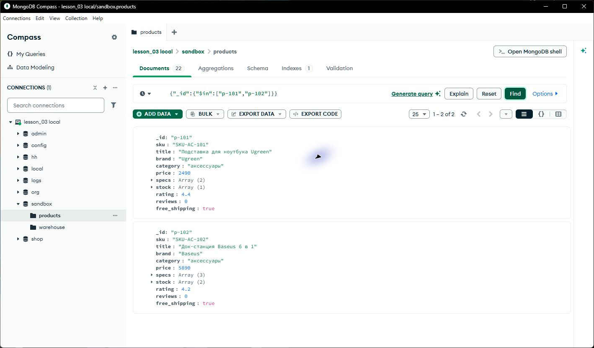
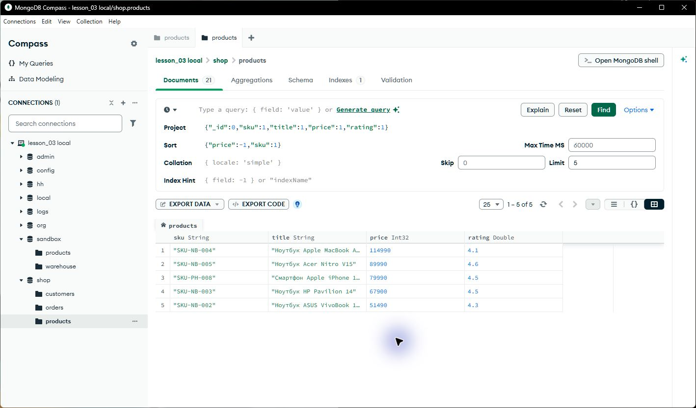
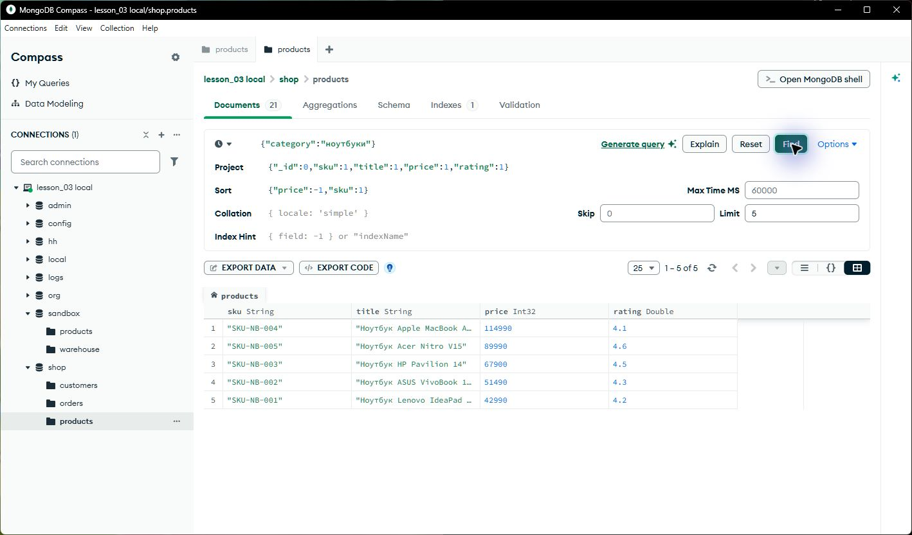
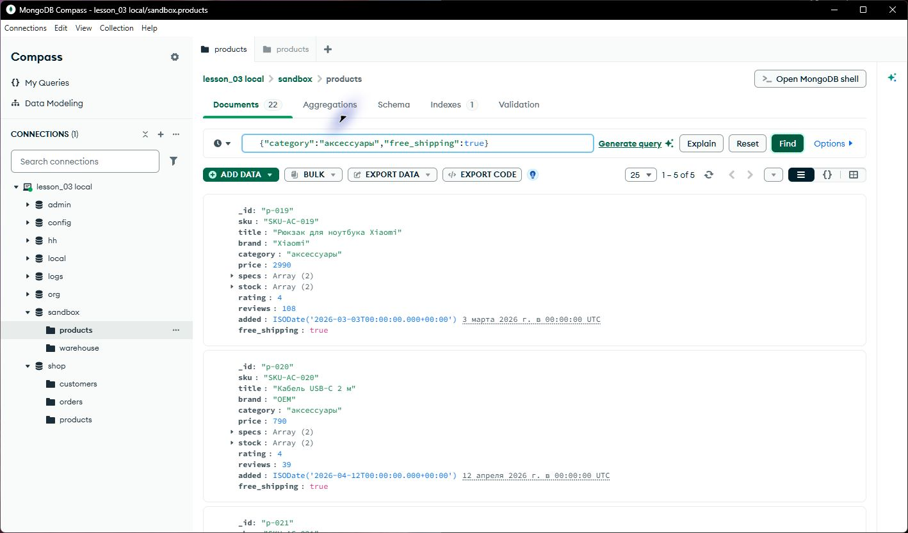
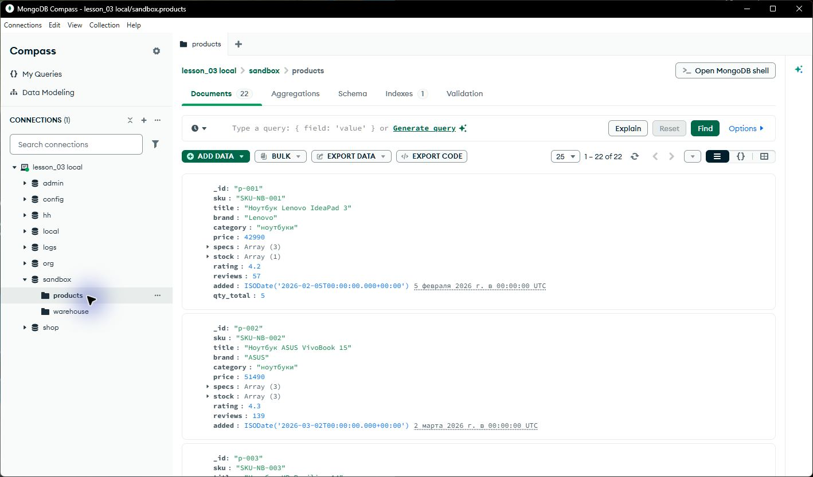

# Отчёт

**ФИО: Колобов Евгений Денисович**

**Группа: 9РПО1**

**Дата:** 27.09.2026

### Среда выполнения

- ОС: Windows
- Язык и версия: Python 3.11.15, PyMongo 4.18.2
- MongoDB / Compass: MongoDB 7.0.43, MongoDB Compass
- База данных: shop, sandbox
- Коллекция: products
- Команда запуска: `python 1/solution.py`

### Результаты

В `shop.products` загружен 21 товар. Программа выводит каталог с сортировкой и страницами; поиск по категории «ноутбуки» нашёл 5 товаров, на 9-й странице результатов нет. В `sandbox.products` обновлены остатки трёх товаров, добавлены подставка Ugreen и док-станция Baseus, удалён снятый с продажи товар и включена бесплатная доставка для 5 аксессуаров. После операций в коллекции 22 товара. Проверка практики: 12 из 12.

### Скриншоты

1. Запуск: 
2. Создание товаров: 
3. Каталог: 
4. Поиск: 
5. Изменение/удаление: 
6. Проверка в базе: 

### Ответы на вопросы

1. Какие поля есть у документа товара? Какие поля должны иметь числовой тип и
   почему цену и количество нельзя хранить строками?

   У товара есть sku, title, brand, category, price, specs, stock, rating и reviews; В MongoDB также _id. Цена, количество на складе, рейтинг и число отзывов должны быть числами. Иначе сортировка, сравнение и $inc сломаются тип

2. Чем обычное чтение коллекции отличается от поиска по условию? Приведите
   пример запроса или фрагмента кода из своей работы.

   Обычное чтение возвращает все документы коллекции. Поиск по условию оставляет только подходящие: `find({"category": "ноутбуки"})` нашёл 5 товаров. Для страницы результата добавлены sort, skip и limit

3. Как вы проверили, что операция действительно изменила данные в MongoDB, а не
   только текст в интерфейсе программы?

   Открыл sandbox.products в Compass и увидел новые товары, обновлённые остатки и free_shipping: true. В коллекции стало 22 документа. + проверка практики прошла 12 из 12 пунктов

### Вывод

Выполнены чтение, поиск, сортировка и изменение товаров через PyMongo. Результаты проверены в MongoDB Compass и скриптом проверки.